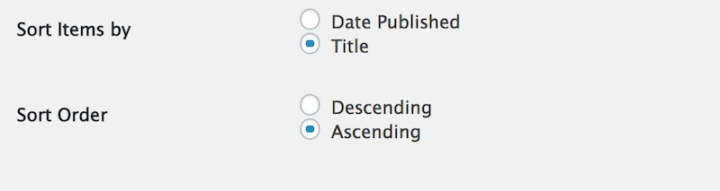
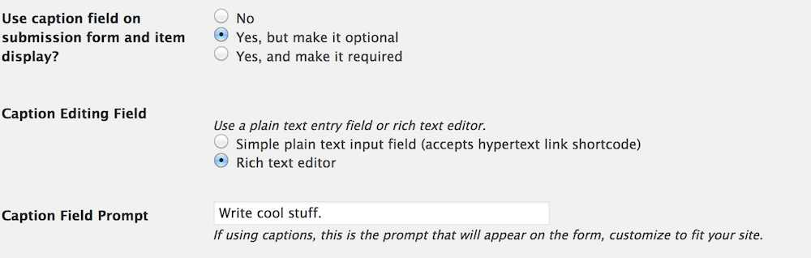
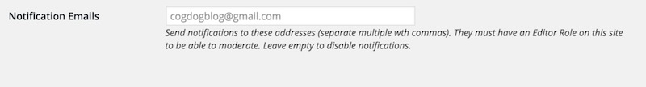

# TRU Collector Wordpress Theme
by Alan Levine http://cogdog.info/ or http://cogdogblog.com/

-----
*If this kind of stuff has any value to you, please consider supporting me so I can do more!*

 

----- 

## What is this?

This Wordpress Theme powers [TRU Collector](http://splot.ca/collector/) a site to allow collections of items (termed "collectables") where contributions can be made without any  logins. This is done by using a generic author account that is silently activated. The user never sees any sign of the innards of Wordpress but can create posts for each collectable. 

The options  allow you to create a simple Upload and go mode, but you can also allow (and require or not), captions, a source description (maybe more than *hey, I found it on GOOGLE*) or a complete rich text editor, and choose a selection of licenses to apply.

You can even enable an address that allows people to publish directly to your collection by old fashioned email.

*Why TRU?* I developed these initially [while on a fellowship](http://cogdog.trubox.ca) at [Thompson Rivers University](http://tru.ca/) as one of a suite of [SPLOT tools](http://splot.ca/splots/).

### See It In Action

* [Animal Body Plans](http://bio2290.trubox.ca/) (for Biology 2290 at TRU)
* [Brand Storytelling](https://jmc3353.adamcroom.com/brandstorytelling/) Ad Copy Layout, University of Oklahoma
* [CogDogRoo Image Collector](https://cog.dog/roo/collector/) for Alan Levine's Nov 2017 Workshops in Victoria, Australia
* [GEOG 2221 Photo Collector](http://geog2221.trubox.ca/)  collecting images from participants in TRU’s GEOG 2221 Course: Regional Geography of Canada
* [Image Pool](http://imagepool.trubox.ca/) - used for TRU workshops on finding images on the web 
* [Imagery VISA 1101_01](http://imagery.trubox.ca/) collecting images from participants in TRU’s VISA 1110 Course: History of Art
* [OER18 Photos](https://oer18.oerconf.org/media/) photos for April 2018 conference in Bristol, UK.
* [Oh No Not the Followers of the Apocalypse](http://ohnonotthe.followersoftheapocalyp.se/) FOTA Images from David Kernohan
* [Online Ecosystem Maps](http://a202dmll.coventry.domains/maps/) a gallery of maps created by students enrolled in the A202DMLL Module (Develop your Online Presence & Own your Web Domain) at Coventry University. 
* [SPLOT Collector](http://splot.ca/collector/) - the development and very first site, stuff can and will break
* [UDG Agora Image Pool](http://udg.theagoraonline.net/imagepool) used by University of Guadalajara faculty and students sharing media in the UDG Agora Project
* [When I Needed Help Gallery](http://gallery.whenineededhelp.com/) an anonymous sharing of domestic abuse survival site

If you make a TRU Collector site, please please pretty please, fork this repo to edit this Readme with a link to your new site.

If you have problems, feature suggestions, piles of unmarked bills to send my way, please [contact me via the issues area](https://github.com/cogdog/tru-collector/issues) on this repo.

## Requirements

I will make the big leap of assumption that you have a self hosted Wordpress site and can install themes. The TRU Collector is a child theme based on [the free and lovely Fukasawa theme by Anders Noren](https://wordpress.org/themes/fukasawa). Install Fukasawa first from your Wordpress Dashboard.

Then, install the tru-collector them to Wordpress directly by ftping it to `wp-content/themes` or using the downloaded ZIP for this repo as an uploaded theme.

## Setting Up a New Collector site

*In this theme Wordpress `Posts` are renamed `Collectables` but have all the attributes of garden variety blog posts.*

(1) Create a fresh new Wordpress site. 

(2) Create a user with login name of "collector" with Author role. No one actually uses the account, the site invisible logs in guests as this user. Make note of and save somewhere the password that Wordpress generates. Leaving it cryptic is fine, no one needs to use it.

(3) Install the [Fukasawa theme](https://wordpress.org/themes/fukasawa) from the Wordpress Dashboard (I'll gamble that you know how to install themes, search on `Fukasawa` from Appearances -- Themes. It does not need to be activated, it just needs to be present.

(4) Install the TRU Collector theme downloaded as part of this repo (use the green **clone or download** button above or [download directly](https://github.com/cogdog/tru-collector/archive/master.zip)).

(5) Activate TRU Collector as the site's theme. In this theme, Posts are renamed **collectables** and thus on the dashboard:

(6) Install and activate the [Remove Dashboard Access plugin](https://wordpress.org/plugins/remove-dashboard-access-for-non-admins/).  The tru-collector theme's options panel will nudge you to install it. This plugin is used to keep the logged in `collector` user from seeing the Wordpress dashboard. Any attempt to reach the dashboard outside of Administrators or editors results in a redirect to the front of the site. The site will work without it, but it makes your  site a tad more bullet proof.

In this plugins settings, restrict access to **Editors and Administrators** or just **Administrators** depending if you will have a moderator user. The default redirect should be for the main URL of the site. 

(7) If you wish to set up a feature to let visitors send photos to your collector via email, install the [Wordpress Jetpack plugin](http://jetpack.me/). You will also need a plugin the converts the first image of a post to a Featured Image;  I like [Auto Thumbailer](https://wordpress.org/plugins/auto-thumbnailer/). See below for setup instructions.

(8) You might want to set up in advance some Wordpress Categories for your Collectables; in the options you will choose one as default (and for the love of all that is holy, *change the name of the Uncategorized category*!

## Setting Up The Site Via TRU Collector options

These instructions are a reference for the settings within the TRU Collector; if you are reading this, you got as far as installing and activating the theme. Below are basic instructions for all of the theme options, which, if this were designed well, you likely do not need me to explain, but #BecauseDocumentation here we go.

### Access Code and Hint

Leave this field blank if you want any visitor to be able to access the submission form on your site (you can always make it less accessible by not having any links as menus for the form. 

If you want to provide an access code (a very weak password), just enter it. Any requests to access to form will be sent to the **front desk** page where a visitor must enter in the code you have entered here to see the form.

Enter a decent **Access Hint** that will be displayed if someone does not enter the correct code.

### Publication Options

The Status for New Collectable lets you set up moderation for new submissions (by choosing `Set to draft`) whereas `Publish immediately` provides instant gratification to your visitors though leaves open the problems of a site where anyone can publish (the latter option thus works for sites where you set up an **Access Code** as described above).

### Sort Options

The default settings are for typical blogs where newest content is displayed first. The sort options allow you to change that across the site- the home page, category/tag archives, and search results.

**Date Published** is the default option, the order is **Descending**, or newest first, change to **Ascending** to have oldest items appear first. 

Change the sort otder to **Title** to... yes... sort items alphabetically by each item's title.  Use **Ascending** for alphabetical order (A-Z) or **Descending** to reverse (Z-A).

### Caption Fields

Set this option to provide a field for visitors to enter a caption for their shared image, and whether to require that something be entered. By setting to **No** this will not appear on the submission form.

There is also an option to enable a rich text editor in place of the default simple text area input. Use this if you want a site where people create formatted content for shared images.

### Source, License, and Attribution

The first two settings operate similarly the Caption field options above. The **Source** field is a single line text entry where a visitor can type in the source of the image (if it includes a URL it will be automatically hyperlinked when the image page is displayed).

The **Rights License** is a drop down menu offering a variety of Creative Commons licenses as well as `All Rights Reserved` (boo!) as well as `Usage Rights Unknown`.

At this time, the only way to edit the licenses displayed (e.g. if you do not want certain ones) is (pathetically on the part of the programmer) to edit `functions.php` in the template directory. Look for the function `trucollector_get_licences` and comment out the lines containing license options to hide.

Enabling the **Cut and Paste Attribution** adds to the image display a field with an automatically formed attribution statement (based on the image's rights license choice) that can be copied after clicking on the text. Neat, eh?

Check **Enable Comments on Items**  to add a standard blog comment field at the bottom of all published photos.

If you have not set up any categories, the **Default Category for New Collectables** menu will not do much. You might want to save your options, and edit your Collectable Categories (Standard Wordpress Categories). Hierarchal ones are not supported (e.g. don't waste your time, use a flat Category structure)

### Notification Emails

Enter any email addresses who should be notified of new submissions; you can use multiple ones if you separate them by a comma.

### Author Account Setup

To provide access to the media uploader, this site uses a Wordpress Authoring Role account that is logged into invisibly to your site visitors (for anyone logged in with an Editor or Administrator account, like you this account is not used).. So your site needs an active user with a name of **collector** and a role of **Author**.

If this account does not exist, create it now. If it does, use the instructions below to generate a new password and then add it to the TRU Collector Options.

You can follow the link to create an account; for an email you can use a fictitious one on your domain. We suggest using the strong password that Wordpress  suggests. Copy that password, and perhaps save it in a safe place. On a stand-alone Wordpress install of the Collector, you can just paste it into the option for the password field.

If this site is on a mulitsite Wordpress install, and the TRU Collector has been used on another site, the `collector` account already exists, so you need to add it to the site via the Author tools. However, you still have to enter the password, so make sure you know the passord that was used on another site. If you do not have access to it, you will have to reset the password at the Network Admin level, and then update the password on the options of all sites using the TRU Collector.

When everything is set up correctly, the options will indicate that you have been a good options configurator! 

If the account is incorrectly set up, when trying the Collector on a site where you are *not* logged in as an Administrator or Editor, when you try to access the collect form, you will see a Wordpress login. This nearly always means the password for the `collector` user does not match the settings in the options.

### JetPack Post by Email (optional)

You can enable a feature that allows people to add an image to your site simply by sending it via email. This uses the Post By Email module that is part of the [Wordpress Jetpack plugin](http://jetpack.me/). The options will check that the plugin is installed and that the module is enabled.

The subject line of the email becomes the title, the body of the email the content, and the first image attached becomes the Collectable -- that is why we suggest using a plugin such as [Auto Thumbailer](https://wordpress.org/plugins/auto-thumbnailer/) that converts the first image to the theme's featured image.

To create an email address that can post via this plugin, any authenticated admin or editor user can generate the `*********@post.wordpress.com` address via their profile; you need not add it to the Collector user as you can only generate it for an account you are logged in to Wordpress with.

The field here is just to keep the email address as a reference; it is not used anywhere in the site-- you most likely do not want to have this email address posted in a public space as it allows direct posting to the site.

We (well I, the person writing this) recommend creating an email forwarding address to use as the one that you share; for example, if the email address I set up as a forwarder was `quickpost@splot.ca` and made to forward to `*********@post.wordpress.com` if I need to change the address, I can just do so at the Wordpress level, update my forwarder, and never have to tell people a new address to use.

Also, your site looks a tad more credible without use of a `wordpress.com` email address (no offense, Wordpress, we love ya).

Also, if you are using Post By Email, you will need to add the [Auto Thumbnailer plugin](https://wordpress.org/plugins/auto-thumbnailer/) so it generates featured images from the ones sent by email.

## Customize the Add / Collect form

You can now customize the field labels and the descriptions of the form where people submit new items to a TRU Collector site. On your site navigate to the collect form, and  activate the Wordpress Customizer from the admin bar. 

There is a special section at the bottom to open:

Then from this pane, open "Collect Form" (eventually the theme options will live here too)

And then you will see a series of fields to edit for all form field elements. For each, you can edit the title/label of the field and the prompt that appears below. As you type in the customizer fields on the left, you will see a live preview on the right (ignore the silly pizza references in the screenshot, the author was just hungry):

## Updating the Theme

If you have ftp/sftp access to your site (or this can be done in a cpanel file manager), simply upload the new theme files to the `wp-content/themes` directory that includes the older version theme. 

For those that lack direct file upload access or maybe that idea sends shivers down the spine, upload and activate the [Easy Theme and Plugin Upgrades](https://wordpress.org/plugins/easy-theme-and-plugin-upgrades/) plugin -- this will allow you to upload a newer version of a theme as a ZIP archive, the same way you add a theme by uploading.

## Adding Hyperlinks to Captions

Any HTML put into the editor for the caption is stripped out. But a new feature allows hyperlinks to be created using a "shortcode" format:

Links show be entered as a `[link]` shortcode where the link `url` is specified as well as the `text` to be used as hypertext:

`[link url="http://www.themostamazingwebsiteontheinternet.com/" text="the coolest site on the internet"]`

This will create a hyperlink like [the coolest site on the internet](http://www.themostamazingwebsiteontheinternet.com/)

To present the link just as a URL, simply use

`[link url="http://www.themostamazingwebsiteontheinternet.com/"]`

which will produce the hyperlink like http://www.themostamazingwebsiteontheinternet.com/ -- all links will open in a new window.

## Add Public Ratings

Installing the [WP-Ratings Plugin](https://wordpress.org/plugins/wp-postratings/) enables public star (or other scale) ratings on items from the front page, archives, and single items. 

## Other Wordpressy Things You Might Want to Do

I like short links, so I typically use a Custom Permalink setting (under `Settings -- Permalinks`) of `/%post_id%/'

 

The theme creates three Pages for you with custom templates. You can edit their content to provide additional information prompt:

* **Desk** The screen where users must enter an access code
* **Collect** The page that includes the form people use to upload content
* **Random** No content needed, it just performs a redirect to a random collectable. Just leave it alone

Set up your own menus as needed; make sure that you click the `Location` tab to tell Wordpress to use the menu you create.

 

Get rid of the default widgets on the site; make it your own

 

Go collect stuff!

## Relatively New Features

* **Enabled for WP-Ratings** With the Wp-Ratings Plugin installed, you can have front page and single item ratings for items
* **Customizer Editor for Upload Form** All field labels and instructions can now be modified via the customizer
* **Rich Text Editor Option** allow for the full Wordpress editor for composing captions
* **Shortcode for Hyperlinks in captions** This one is for you Daniel!
* **Display Order Options** Theme options now allows front page, archive, search results can be sorted by date published (default) or by title, and also the order can be ascending or descending
* **Options Refreshed** Recoded the theme options better organized and also so documentation now links to GitHub most recent documentation (what you are looking at!)

