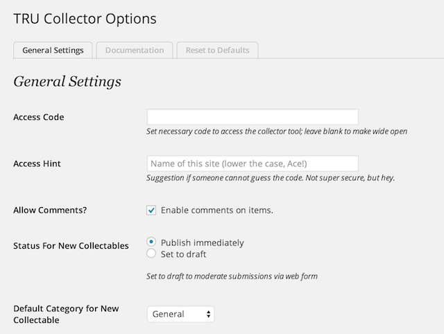

# TRU Collector Wordpress Theme
by Alan Levine http://cogdog.info/ or http://cogdogblog.com/

## What is this?
This Wordpress Theme powers [TRU Collector](http://splot.ca/collector/) a site to allow collections of images (termed "collectables") where contributions can be made without any silly logins. This is done by using a generic author account that is silently activated. The user never sees any sign of the innards of Wordpress but can create posts for each collectable.

A future version might be able to accept video URLs as sources as well (using the Video Content type of the theme), and more options to control appearance/requirement of form fields.

### See It In Action

* SPLOT Collector (my development site) [http://splot.ca/collector/](http://splot.ca/collector/)
* Image Pool (used for workshops on finding images on the web) [http://imagepool.trubox.ca/](http://imagepool.trubox.ca/)

## Requirements
I will make the big leap in that you have a self hosted Wordpress site and can install themes. The TRU Collector is a child theme based on [the free Fukawasa theme by Anders Noren](https://wordpress.org/themes/fukawasa) 

Very very crucial. Do not just use the zip of this repo as a theme upload. It will not work. If you are uploading in the wordpress admin, you will need to make separate zips of the two themes (tru-collector and fukawasa) the latter only if not installed via the Wordpress theme manager, and upload each as its own zip.

In addition the site uses the [Remove Dashboard Access](https://wordpress.org/plugins/remove-dashboard-access-for-non-admins/) which can be installed directly in your site The theme will nudge you to install it. It is used to keep the logged in user from seeing the admin side of Wordpress. Any attempt to reach the dashboard outside of Administrators or editors results in a redirect to the front of the site.

## Setting Up a New Collector site

(1) Create a fresh Wordpress site. 

(2) Create a User with login name of "collector" with Author role. No one actually uses the account, the site invisible logs in guests as this user. Make note of the password. Make it cryptic.

** SUPER IMPORTANT ** For the account to log a visitor in, you must edit the file /includes/misc.php to match the password of this account

*Yes, I know this is ugly. There's not much this account can do, and one day I may find the way to store this more securely. Or you might fork this code, and show me how it can be done*

(3) Install the [Fukawasa theme](https://wordpress.org/themes/fukawasa).

(4) Install the TRU Collector theme downloaded as part of this repo; either by uploading to your wp-content/themes directory or making  ZIP if just the tru-collector contents and uploading as a theme.

(5) Activate TRU Collector as the site's theme. In this theme, Posts are renamed **collectables** and thus on the dashboard:

(6) Install and activate the [Remove Dashboard Access plugin](https://wordpress.org/plugins/remove-dashboard-access-for-non-admins/).   In its settings, restrict access to **Editors and Administrators** or just **Administrators** depending if you will have a moderator user. The default redirect should be for the main URL of the site.

(7) Set the TRU Collector Options (link is on Admin menubard and under Appearances in dashboard). 
Create a user account with Author capability. For now, you have to edit  **/includes/misc.php)** to provide credentials for the auto login.

Leave the access code blank to allow complete open access. Otherwise, enter a code that users must present to see the upload tools. Add a hint that will help in case someone gets the access code wrong. 

Other settings should be easy to figure out. 

 

The remaining options allow you to designate who gets an email notification of new entries. The bottom line will provide an indication to show if the author account is correctly set up.

(8) The theme creates three Pages which custom templates. You can edit their content to provide additional information:

* **Desk** The screen where users must enter an access code
* **Collect** The page that includes the form people use to upload content
* **Random** No content needed, it just performs a redirect to a random collectable

(9) Custom Menus as needed. Suggestion:

 

(10) Configure Widgets. Suggestion:

 

