# TRU Collector Wordpress Theme
by Alan Levine http://cogdog.info/ or http://cogdogblog.com/

-----
*If this kind of stuff has any value to you, please consider supporting me so I can do more!*

 

----- 

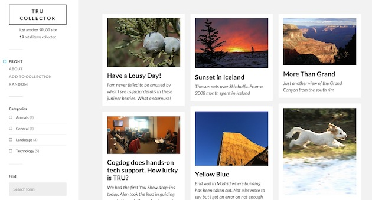

## What is this?

This Wordpress Theme powers [TRU Collector](http://splot.ca/collector/) a site to allow collections of items (termed "collectables") where contributions can be made without any  logins. This is done by using a generic author account that is silently activated. The user never sees any sign of the innards of Wordpress but can create posts for each collectable. 

The options  allow you to create a simple Upload and go mode, but you can also allow (and require or not), captions, a source description (maybe more than *hey, I found it on GOOGLE*) or a complete rich text editor, and choose a selection of licenses to apply.

You can even enable an address that allows people to publish directly to your collection by old fashioned email.

*Why TRU?* I developed these initially [while on a fellowship](http://cogdog.trubox.ca) at [Thompson Rivers University](http://tru.ca/) as one of a suite of [SPLOT tools](http://splot.ca/splots/).

## With Thanks

SPLOTs have no venture capital backers, no IPOs, no real funding at all. But they have been helped along by a few groups worth recognizing with an icon and a link.

The original TRU Collector was developed under a [Thompson Rivers University Open Learning Fellowship](http://cogdog.trubox.ca/) and further development was supported in part by a [Reclaim Hosting Fellowship](http://reclaimhosting.com), an [OpenETC grant](https://opened.ca), Coventry University's [Disruptive Media Learning Lab](https://dmll.org.uk/)  plus ongoing support by [Patreon patrons](https://patreon.com/cogdog).

       

### See It In Action

* [Ada Lovelace Day](https://thinking.is.ed.ac.uk/ald2017/) 
* [Animal Body Plans](http://bio2290.trubox.ca/) Biology 2290 at TRU
* [Bingobones](http://bingobones.com/) Skulls and their Stories from some fun at the Open Education 2018 project
* [Brand Storytelling](https://jmc3353.adamcroom.com/brandstorytelling/) Ad Copy Layout, University of Oklahoma
* [Cafecrema](https://cafecrema.procaffination.ca/) Cat pix
* [The Compendium of Bothersome Beasties](http://creditcontinue.coventry.domains/beasties/) from Coventry University is a tool for self-reflection and formative assessment.
* [CogDogRoo Image Collector](https://cog.dog/roo/collector/) for Alan Levine's Nov 2017 Workshops in Victoria, Australia
* [Coventry University Digital Leaders](http://digitalleaders.coventry.domains/who/)
* [DoOO Something](https://iwanna.dooosomething.org/) "Domain of One’s Own projects often start with domains/sites for individuals, but they can also include any other sites that individual or groups of staff and students might want the freedom to create for themselves."
* [EduHack Directory](https://eduhack.eu/coursedirectory/)
* [Fanny Central](https://fannycentral.com/) for collecting inappropriately captioned old images. 
* [Femedtech Quilt of Care and Justice in Open Education](https://quilt.femedtech.net/) showcases quilt sections shared
* [Fleming Techbank](http://techbank.flemingdomains.ca/) Fleming College's Digital Learning Technologies Inventory
* [Flora and Fauna](https://florafauna.buffscreate.net/)
* [Fun Photos](https://camp2019.photos.learn4growth.com/)
* [GEOG 2221 Photo Collector](http://geog2221.trubox.ca/)  collecting images from participants in TRU’s GEOG 2221 Course: Regional Geography of Canada
* [Image Pool](http://imagepool.trubox.ca/) - used for TRU workshops on finding images on the web 
* [Imagery VISA 1101_01](http://imagery.trubox.ca/) collecting images from participants in TRU’s VISA 1110 Course: History of Art
* [Mineral Books](https://mwynau.com/)
* [OER18 Photos](https://oer18.oerconf.org/media/) photos for April 2018 conference in Bristol, UK.
* [Oh No Not the Followers of the Apocalypse](http://ohnonotthe.followersoftheapocalyp.se/) FOTA Images from David Kernohan
* [Online Resilience](https://onlineresilience.uni-med.net/) UNIMED collection of  member organization responses to COVID-19
* [OpemMed Album](http://oercollector.openmedproject.eu/) Open Images from OpenMed meetings
* [Online Ecosystem Maps](http://a202dmll.coventry.domains/maps/) a gallery of maps created by students enrolled in the A202DMLL Module (Develop your Online Presence & Own your Web Domain) at Coventry University.
* [Online Worlds](http://coventry.domains/online-worlds/) another Coventry activity for collecting images of how people see their online worlds. 
* [OWLTEH Catalogue](http://catalogue.owlteh.org/) Open Web For Learning & Teaching Expertise Hub -- a Catalogue of the Open Web: applications, platforms, techologies, or concepts
* [PlayBox - CreativeCulture Compendium of Games for Playful Learning](https://playbox.mycapsule.my/) "Open space that acts as a resource centre for sharing creative and innovative artefacts used for gamification in STEAM subjects"
* [Learning on/with the Open Web Participants](https://conf.owlteh.org/participants/) 
* [Learning on/with the Open Web Conference Photos](https://www.conf.owlteh.org/photos/)
* [The Legend of Extend](https://play.learningnuggets.ca/cms) Terry Greene's card collection
* [Reclaim Roadshow Participants](https://roadshow.reclaimhosting.com/participants/)
* [SPLOT Collector](http://splot.ca/collector/) - the development and very first site, stuff can and will break
* [Tech Collect](https://techcollect.cbsinkinson.com/) CU Boulder
* [UDG Agora Image Pool](http://udg.theagoraonline.net/imagepool) used by University of Guadalajara faculty and students sharing media in the UDG Agora Project
* [What's Happening?](https://whatshappeningart.com/) "An Experimental Journey of Artistic Inquiry"
* [Wordbox](http://origin.coventry.domains/wordbox/) Coventry University Art and Design Skills Hub
* [Your Mineral Site](https://yourmineralsite.mineralcollective.com/)

Please please pretty please, if you make a TRU Collector site, fork this repo to edit this Readme with a link to your new site. If you have problems, feature suggestions, piles of unmarked bills to send my way, please [contact me via the issues area](https://github.com/cogdog/tru-collector/issues) on this repo.

## Experiment Lab

TRU Collector has Custom API endpoint that is used to offer up random photos from the site. See [The SPLOT Image Truck is Here!](https://cogdogblog.com/2019/03/splot-truck/) and these demo sites

* [Inspire Me with a Random SPLOT Image](https://cogdog.github.io/splotlab/randysplot/)
* [Glitch a Random SPLOT Image](https://cogdog.github.io/splotlab/glitchsplot/) (see [blog post](https://cogdogblog.com/2019/04/glitch-a-splot/))

### TRU Collector Sightings

* Samantha Clarke presenting the way TRU Collector was used to build the [The Compendium of Bothersome Beasties](http://creditcontinue.coventry.domains/beasties/) at the ALTC 2018 Conference https://www.youtube.com/watch?v=e1f5PY-uREE

## Installing From Reclaim Hosting

If you are wise enough to host your web sites at [Reclaim Hosting](http://reclaimhosting.com/) you have the option of installing a fully functioning site with this theme ([a copy of the demo site](http://lab.cogdogblog.com/collector/)) including recommended plugins, configured settings and sample content, all done  in one click. *But wait there is more!* With this method of installing your site, future updates to the theme are automatically added to your site.

In your cpanel, under **Applications** go to **All Applications**. This theme is available listed under Fratured Applications; just install from there.

*Note that unlike other WordPress installs, this one will not preserve your username/password, so be sure to save that information.* When it's done, log into your new site and start making it your own. 

### Installing TRU Writer from Scratch

Using this theme requires a self-hosted--or institutionally hosted (lucky you)-- Wordpress site (the kind that you download from [wordpress.org](http://www.wordpress.org). You cannot use this theme on the free "wordpress.com" site. Maybe check out [Reclaim Hosting](https://reclaimhosting.com/) if you need to set up your own hosting space. 

The TRU Collector is a child theme based on [the free and elegant Fukasawa theme by Anders Noren](https://wordpress.org/themes/fukasawa). Install this theme first from within the Wordpress Dashboard under **Appearance** -- **Themes** searching on `Fukasawa`.

Download the TRU Collector theme (use the green **Clone or Download** button above) as a ZIP file.

The zip can be uploaded directly to your site via **Add Themes** in the Wordpress dashboard. Of you run into size upload limits or just prefer going old school like me, unzip the package and ftp the entire folder into your `wp-content/themes` directory.

To get the theme working, activate the "TRU Collector" theme when it appears in your Wordpress dashboard under **Appearance** --> **Themes**. 

### Updating the TRU Collector Theme (manually)

*Note (Dec 18, 2018) If your site's images are stacked, or it looks like there are only 1 or 2 in a collection, it's likely because of a change to the parent Fukasawa theme and or the WordPress 5.0 update that was automatically updated on your site. An update to TRU Collector version 1.5 or later will fix this issue.*

If you have ftp/sftp access to your site (or this can be done in a cpanel file manager), simply upload the new theme files to the `wp-content/themes` directory that includes the older version theme. 

For those that lack direct file upload access or maybe that idea sends shivers down the spine, upload and activate the [Easy Theme and Plugin Upgrades](https://wordpress.org/plugins/easy-theme-and-plugin-upgrades/) plugin -- this will allow you to upload a newer version of a theme as a ZIP archive, the same way you add a theme by uploading.

## Setting Up a New Collector site

*In this theme Wordpress `Posts` are renamed `Collectables` but have all the attributes of garden variety blog posts.*

(1) Create a fresh new Wordpress site. 

(2) Create a user with login name of "collector" with Author role. No one actually uses the account, the site invisible logs in guests as this user. Make note of and save somewhere the password that Wordpress generates. Leaving it cryptic is fine, no one needs to use it.

(3) Install the [Fukasawa theme](https://wordpress.org/themes/fukasawa) from the Wordpress Dashboard (I'll gamble that you know how to install themes, search on `Fukasawa` from Appearances -- Themes. It does not need to be activated, it just needs to be present.

(4) Install the TRU Collector theme downloaded as part of this repo (use the green **clone or download** button above or [download directly](https://github.com/cogdog/tru-collector/archive/master.zip)).

(5) Activate TRU Collector as the site's theme. In this theme, Posts are renamed **collectables** and thus on the dashboard:

(6) Install and activate the [Remove Dashboard Access plugin](https://wordpress.org/plugins/remove-dashboard-access-for-non-admins/).  The tru-collector theme's options panel will nudge you to install it. This plugin is used to keep the logged in `collector` user from seeing the Wordpress dashboard. Any attempt to reach the dashboard outside of Administrators or editors results in a redirect to the front of the site. The site will work without it, but it makes your  site a tad more bullet proof.

In this plugins settings, restrict access to **Editors and Administrators** or just **Administrators** depending if you will have a moderator user. The default redirect should be for the main URL of the site. 

(7) You might want to set up in advance some Wordpress Categories for your Collectables; in the options you will choose one as default (and for the love of all that is holy, *change the name of the Uncategorized category*!

## Setting Up The Site Via TRU Collector options

These instructions are a reference for the settings within the TRU Collector; if you are reading this, you got as far as installing and activating the theme. Below are basic instructions for all of the theme options, which, if this were designed well, you likely do not need me to explain, but #BecauseDocumentation here we go.

### Access to Collector

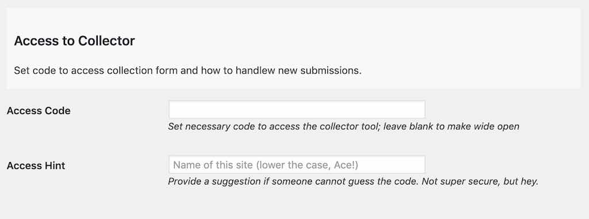

Leave this field blank if you want any visitor to be able to access the submission form on your site (you can always make it less accessible by not having any links as menus for the form. 

If you want to provide an access code (a very weak password), just enter it. Any requests to access to form will be sent to the **Welcome Desk** page where a visitor must enter in the code you have entered here to see the form.

Enter a decent **Access Hint** that will be displayed if someone does not enter the correct code.

### Special Pages Setup

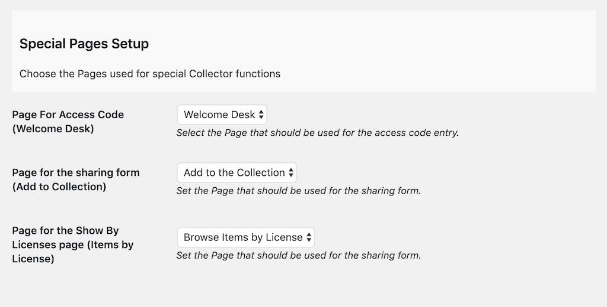

This theme has three pages that must be created; each is associated with a specific template that provide it's functionality. Activating the theme *should* create these all for you when the theme is activated, but if not, create them as described below. You can edit the content of  the pages to customize the prompt seen by writers on your site.

If the theme does not do so automatically (and it should) create these Wordpress **Pages**. You can modify the titles, and add whatever content you want to appear at the top as instructions. Unlike previous versions, there is no need for a specific url  for the page. 

* **Collect** -- The page that provides the collection form, see [http://splot.ca/collector/collect](http://splot.ca/collector/collect).  Whatever you include in the body (not required) is added to the top of the form, maybe for extra instructions.e.g. for a site at `http://coolest.site.org/` the page can be published at `http://coolest.site.org/collecting` When you create a Collection Form page, under **Page Atributes**, select the Template named `Add to Collection`.

* **Welcome Desk** -- The page that provides users will see first if they must enter an access code to access the writing tool (see below). If no access code is required, it redirects to the page above for the writing form-- like  [http://splot.ca/collector/desk](http://splot.ca/collector/desk).  Whatever you include in the body (not required) is added to the top of the form, maybe for a friendly prompt .e.g. for a site at `http://coolest.site.org/` the page might be published at `http://coolest.site.org/guard_dog` When you create a Welcome Desk page, under **Page Atributes**, select the Template named `Welcome Desk`.

* **Browse Items By License** -- If you ask visitors to select a reuse license, this page provides a way to see all items that share the same license-- like [http://splot.ca/collector/licensed/](http://splot.ca/collector/licensed/).  When you create a Browse By License page, under **Page Atributes**, select the Template named `Items by License`.

In the theme options, make sure you have selected the Page that is designated for these purposes.

### Publish Settings

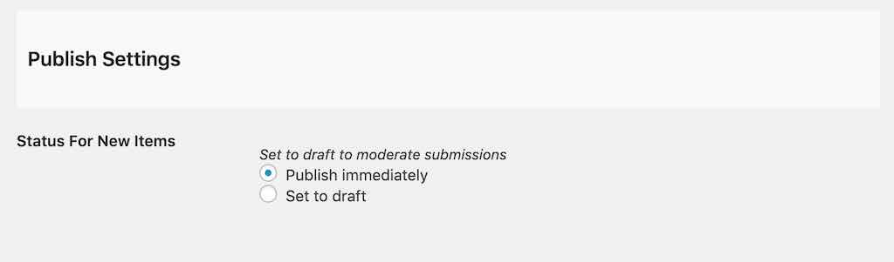

The Status for New Collectable lets you set up moderation for new submissions (by choosing `Set to draft`) whereas `Publish immediately` provides instant gratification to your visitors though leaves open the problems of a site where anyone can publish (the latter option thus works for sites where you set up an **Access Code** as described above).

Enter any email addresses who should be notified of new submissions; you can use multiple ones if you separate them by a comma.

### Sort Options

The default settings are for typical blogs where newest content is displayed first. The sort options allow you to change that across the site- the home page, category/tag archives, and search results.

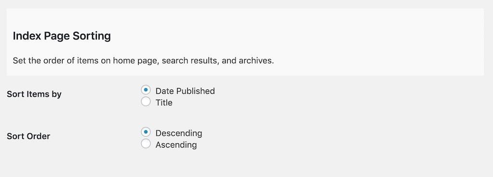

**Date Published** is the default option, the order is **Descending**, or newest first, change to **Ascending** to have oldest items appear first. 

Change the sort otder to **Title** to... yes... sort items alphabetically by each item's title.  Use **Ascending** for alphabetical order (A-Z) or **Descending** to reverse (Z-A).

### Fields and Options for Items

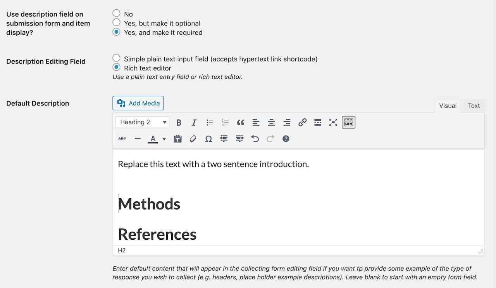

Set the description options to choose whether provide a field for visitors to enter a caption/description for their shared item, and whether to require that something be entered. By setting to **No** this will not appear on the submission form or will any descriptions be displayed..

Next is the option to enable a rich text editor in place of the default simple text area input. Use this if you want a site where people create formatted blog=post like content or plain text captions.

You can also populate the editor (other type) with default content, for example, if you wanted  descriptions to have certain headings.

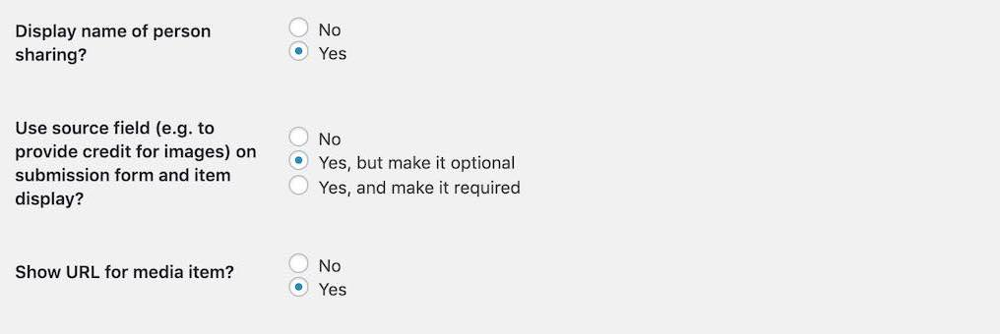

Enabling  **Display Name of Person Sharing** provides the input field to the form, and enables the display of its value on a single view.

The **Source** field is a single line text entry where a visitor can type in the source of the image (if it includes a URL it will be automatically hyperlinked when the image page is displayed).

Enabling  **Show URL for media item** enables the display of a link for the uploaded media on a single view.

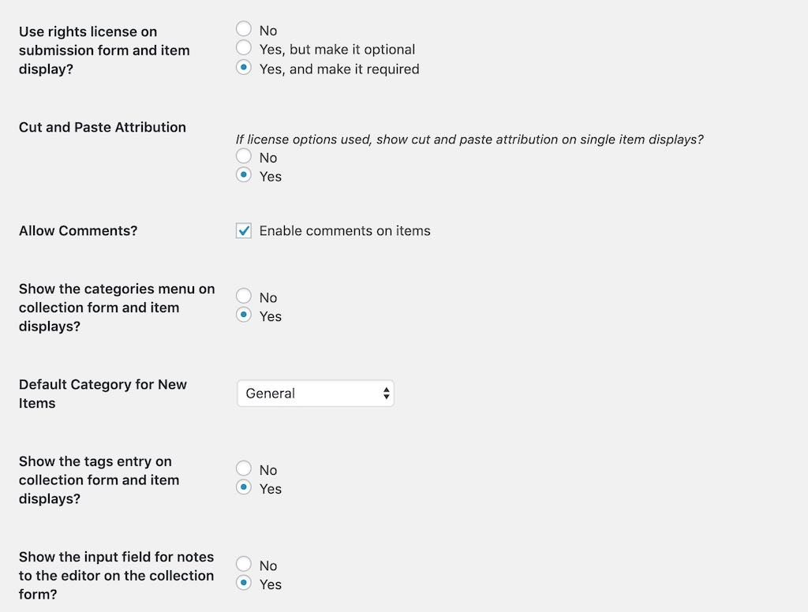

The **Rights License** is a drop down menu offering a variety of Creative Commons licenses as well as `All Rights Reserved` (boo!), and a `Usage Rights Unknown` choice.

Enabling the **Cut and Paste Attribution** adds to the image display a field with an automatically formed attribution statement (based on the image's rights license choice) that can be copied after clicking on the text.

Check **Enable Comments on Items**  to add a standard blog comment field at the bottom of all published items.

If you want users to choose categories, enable it on the form (setting to "no" will hide categories on the view page).

If you have not set up any categories, the **Default Category for New Collectables** menu just give you a choice of `Uncategorized`. If you want to modify this setting, first save your options,  edit your **Collectable Categories** (standard Wordpress Categories accessed under Collectables in the Dashboard), and return here to set up the desired default category. Please, don't leave `Uncategorized` on your site!

If you want users to enter tags, enable it on the form (setting to "no" will hide tags on the view page).

The last option here creates field on the input form for users to send information that is not displayed.

### Email Options

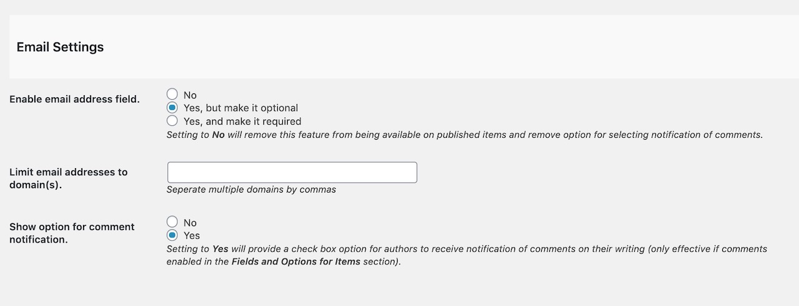

Activating the email form field creates a means for visitors who wish to edit their entry later to get a special edit link sent via email. This feature can be disabled; enabled as optional, or as a required entry.

If you use this option, you can also enter a specific domain (or a comma separated list) to say require email addresses to be official work or school ones.

The third setting here can activate a checkbox on the entry form that let's a visitor choose to receive comment notifications via email.

### Author Account Setup
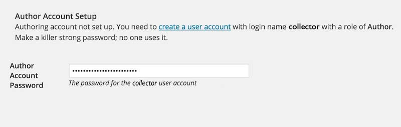

To provide access to the media uploader, this site uses a Wordpress Authoring Role account that is logged into invisibly to your site. So your site needs a user account with a name of **collector** and a role of **Author**. If this site is on a mulitsite Wordpress install, and the TRU Collector has been used on another site, the `collector` account already exists, so you need to add it to the site via the Author tools. 

You can follow the link to create an account; for an email you can use a fictitious one on your domain. We suggest using the strong password that Wordpress suggests.

** Note: As of version 1.1 of TRU Collector you no longer need to copy the password into the options page. ** If you are using a version of the theme that has a password field in the options, maybe it's a good time to update? Otherwise, [see an older version of this ReadMe](https://github.com/cogdog/tru-collector/blob/a8637ef4739a6aa64210fee5ddffe8426cfa62b3/README.md#author-account-setup) for instructions.

## Customize the Add / Collect form

You can now customize the field labels and the descriptions of the form where people submit new items to a TRU Collector site. On your site navigate to the collect form, and  activate the Wordpress Customizer from the admin bar. 

There is a special section TRU Collector tab to open:

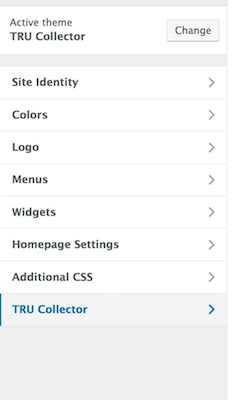

Then from this pane, open "Collect Form" 

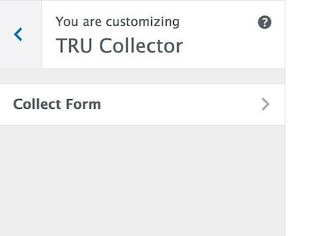

And then you will see a series of fields to edit for all form field elements. For each, you can edit the title/label of the field and the prompt that appears below. As you type in the customizer fields on the left, you will see a live preview on the right (ignore the silly pizza references in the screenshot, the author was just hungry):

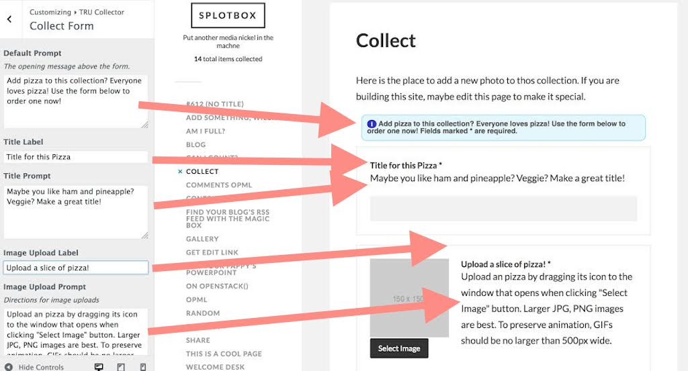

A new feature is a menu item under **Customize** that allows you to open the customizer with the current collection form displayed.

## Customize the collection

A new section for the TRU Collector Customizer **Collection Info** allows you to specify the name for the kinds of things in your collection as it is displayed on the sidebar below the site name.

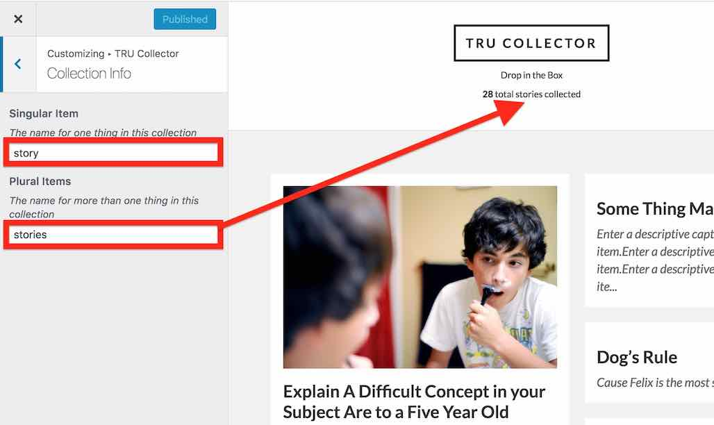

## Browse by Licenses

The TRU Collector provides archives of content that have the same reuse license (if the feature is activated via the TRU Collector options). Just make sure there is a Wordpress Page that uses the template  `Browse by license` -- and the Page is selected in the theme options (see above). This page is created automatically on new sites, or simply by activating the theme again (activate the parent Fukasawa, then activate TRU Collector again).

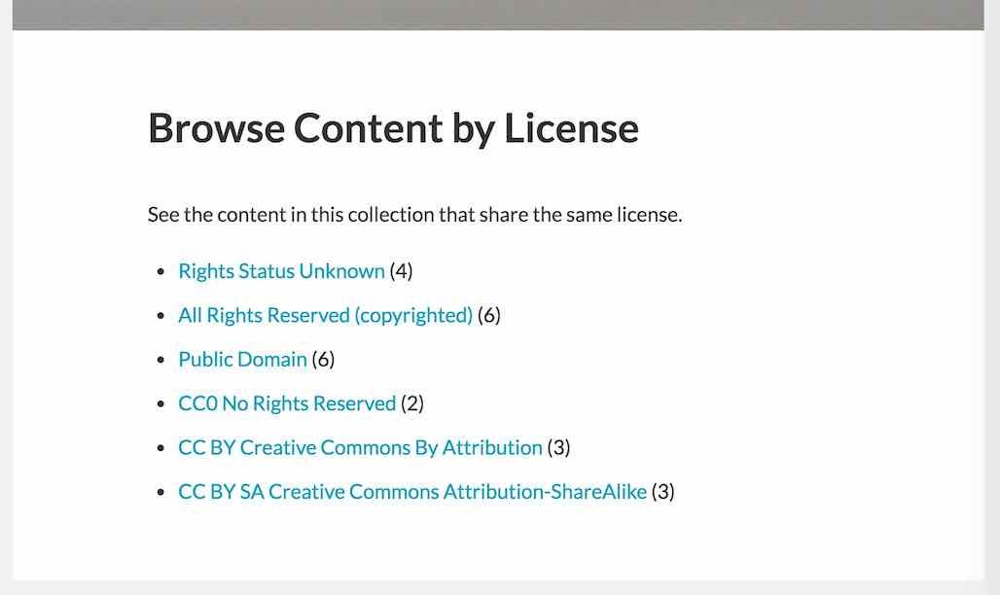

This page (see [example](http://splot.ca/collector/licensed/)) provides links to view all content with the licenses available on the collect form. The url including `licensed/cc-by` yields all items with a Creative Commons CC By Attribution license [example](http://splot.ca/collector/licensed/cc-by).

Use the page to find links to the ones you wish to use and add to your site's menus or widgets. If the links do not work, you may have to go to **Settings** -- **Permalinks** and just click save to regenerate the settings.

For extra flexibility there is a `[licensed]` shortcode that can be used in a widget or any page to display the same index list in a sidebar. By default, it lists only licenses used (e.g. it skips licenses with zero uses); to show all licenses, use the code `[licensed show="all"]`.

## Updating the Theme

If you have ftp/sftp access to your site (or this can be done in a cpanel file manager), simply upload the new theme files to the `wp-content/themes` directory that includes the older version theme. 

For those that lack direct file upload access or maybe that idea sends shivers down the spine, upload and activate the [Easy Theme and Plugin Upgrades](https://wordpress.org/plugins/easy-theme-and-plugin-upgrades/) plugin -- this will allow you to upload a newer version of a theme as a ZIP archive, the same way you add a theme by uploading.

## Shortcode Adding Hyperlinks to Simple Captions

Any HTML put into the plain text editor for the caption is stripped out. But a new feature allows hyperlinks to be created using a "shortcode" format:

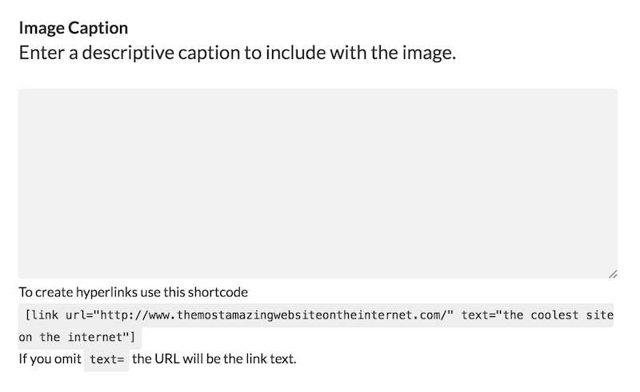

Links show be entered as a `[link]` shortcode where the link `url` is specified as well as the `text` to be used as hypertext:

`[link url="http://www.themostamazingwebsiteontheinternet.com/" text="the coolest site on the internet"]`

This will create a hyperlink like [the coolest site on the internet](http://www.themostamazingwebsiteontheinternet.com/)

To present the link just as a URL, simply use

`[link url="http://www.themostamazingwebsiteontheinternet.com/"]`

which will produce the hyperlink like http://www.themostamazingwebsiteontheinternet.com/ -- all links will open in a new window.

## Add Public Ratings

Installing the [WP-Ratings Plugin](https://wordpress.org/plugins/wp-postratings/) enables public star (or other scale) ratings on items from the front page, archives, and single items. Visitors can rate content using a variety of ratings (1-5 stars, thumbs up/down, etc).

See it in action on the SPLOT demo site [front page](http://splot.ca/collector/) or [single item](http://splot.ca/collector/393/).

## Tiled Displays 

Install the [WP-Tiles plugin](https://wordpress.org/plugins/wp-tiles/) to create alternative views of your collections as a tiled gallery. The plugin provides  way to create a variety of grid styles, and can be added to a Page in your site using a shortcode. This can even be set to be the FRONT page of your site using **Settings** -> **Reading** in your WordPress dashboard as was down for the [#OWLTEH18 Conference Photos site](https://www.conf.owlteh.org/photos/):

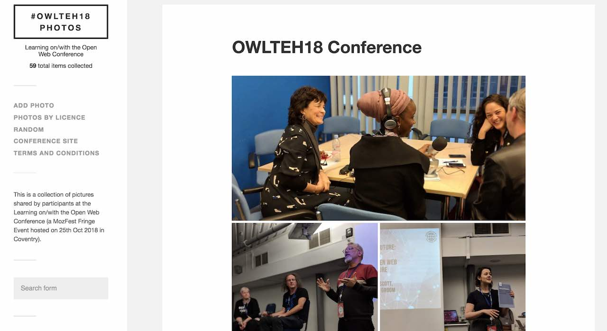

Or see examples as internal pages from the [SPLOT demo site](http://splot.ca/collector/mural/) or the [Mural UDG project Accumulador site](https://muraludg.org/acumulador/mural/).

Learn more about using this plugin https://cogdogblog.com/2018/01/tiling-splots/

## Fix Rotated Mobile Phone Photos

If contributors to your collection will be uploading photos directly from a smart phone, install the [iOS Image Fixer plugin](https://wordpress.org/plugins/ios-images-fixer/) to fix [problems associated with portrait mode photos that end up uploaded as sideways images](https://wordpress.org/plugins/ios-images-fixer/).

## Other Wordpressy Things You Might Want to Do

I like short links, so I typically use a Custom Permalink setting (under `Settings -- Permalinks`) of `/%post_id%/'

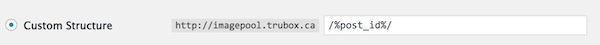 

The theme creates a special URL `/random` to provide a link that shows a random item, e.g. http://splot.ca/collector/random

Set up your own menus as needed; make sure that you click the `Location` tab to tell Wordpress to use the menu you create.

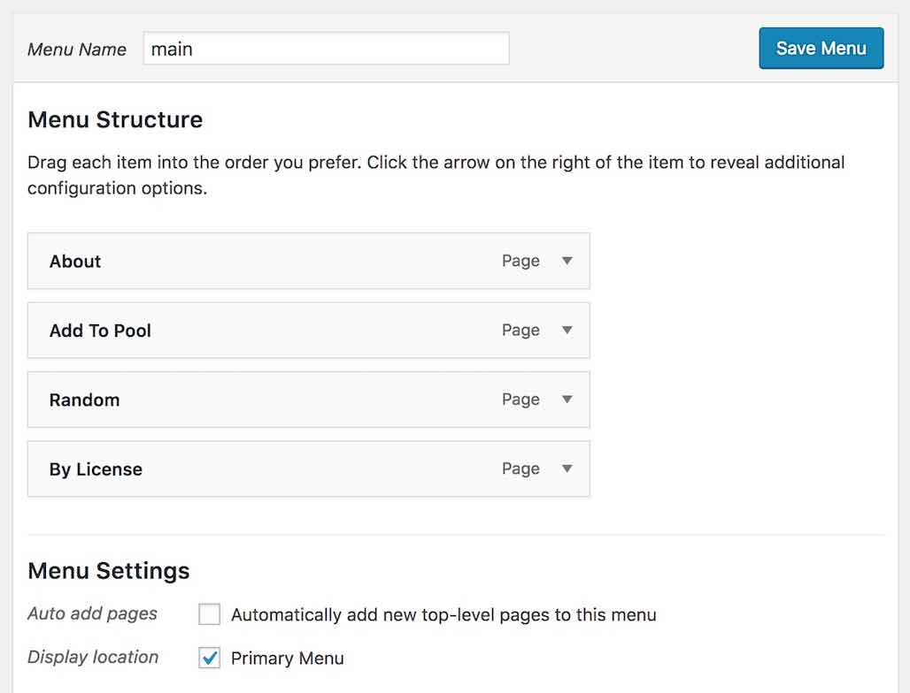 

Get rid of the default widgets on the site; make it your own

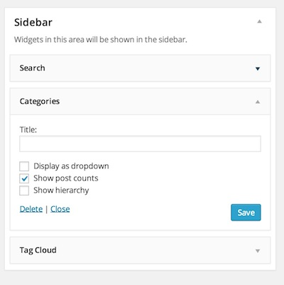 

Go collect stuff!

## Relatively New Features

* **Default Description Content** And one more new theme option to pre-populate the description field with default content.

* **Comment Options**  The email entry form now has an option to require entry, as well as another one to allow content creator to choose to receive email notifications of comments.

* **Post Publishing Editing** Not enabled by default, but a new theme option can add to the collection form an email field (optional) that sends a user a special link that can be used to edit an entry later. This also adds a button to single item pages that can request the edit link.

**Options for Special Pages**  No longer are pages for the Welcome Desk (where access codes are entered) and Collector form required to have a set URL; you can create any Page desired for these functions, and set them as the active ones via the theme options.

* **Name the items** New customizer panel to create the name of the item/items in the collection displayed below the site name (replacing generic "item/items")
* **Better Rich Text Editor** the visual editor will now embed media WordPress supports (YouTube, twitter, soundcloud, etc)
* **Preview Option** on collect form allows reviewing content in overlay preview before submitting (embedded tweets do not render in preview, just a big space).
* **By Licenses Shortcode** useful for putting an indexed list of items by licenses into widget or any page.
* **New Login Code** removes the need to copy the collector user's password to the theme options. The special user account is closed after their item is uploaded. Also, there are new admin notices to activate or install the two recommended plugins
* **Enabled for WP-Ratings** With the Wp-Ratings Plugin installed, you can have front page and single item ratings for items
* **Customizer Editor for Upload Form** All field labels and instructions can now be modified via the customizer
* **Rich Text Editor Option** allow for the full Wordpress editor for composing captions
* **Shortcode for Hyperlinks in captions** This one is for you Daniel!
* **Display Order Options** Theme options now allows front page, archive, search results can be sorted by date published (default) or by title, and also the order can be ascending or descending
* **Options Refreshed** Recoded the theme options better organized and also so documentation now links to GitHub most recent documentation (what you are looking at!)

