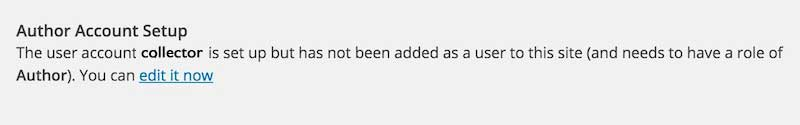
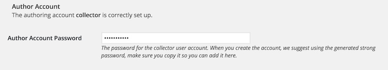

# TRU Collector Wordpress Theme
by Alan Levine http://cogdog.info/ or http://cogdogblog.com/

## What is this?
This Wordpress Theme  powers [TRU Collector](http://splot.ca/collector/) a site to allow collections of images (termed "collectables") where contributions can be made without any silly logins. This is done by using a generic author account that is silently activated. The user never sees any sign of the innards of Wordpress but can create posts for each collectable. 

The options can allow you to create a simple Upload and go mode, but you can also allow (and require or not), captions, a source description (where the person for the image from *hey, I found it on GOOGLE*), and a selection of a usage rights.

And to be super slick, you can even enable an email address that allows people to publish directly to your collection by old fashioned email.

*Why TRU?* I developed these initially [while on a fellowship](http://cogdog.trubox.ca) at [Thompson Rivers University](http://tru.ca/) as one of of a suite of [SPLOT tools](http://splot.ca/splots/).

### See It In Action

* [SPLOT Collector](http://splot.ca/collector/) - the development site, stuff can and will break
* [Image Pool](http://imagepool.trubox.ca/) - used for TRU workshops on finding images on the web 
* [Animal Body Plans](http://bio2290.trubox.ca/) (for Biology 2290 at TRU)
* [Imagery VISA 1101_01](http://imagery.trubox.ca/) collecting images from participants in TRU’s VISA 1110 Course: History of Art
* [GEOG 2221 Photo Collector](http://geog2221.trubox.ca/)  collecting images from participants in TRU’s GEOG 2221 Course: Regional Geography of Canada
* [UDG Agora Image Pool](http://udg.theagoraonline.net/imagepool) used by University of Guadalajara faculty and students sharing media in the UDG Agora Project
* [Oh No Not the Followers of the Apocalypse](http://ohnonotthe.followersoftheapocalyp.se/) FOTA Images from David Kernohan

## Requirements
I will make the big leap in that you have a self hosted Wordpress site and can install themes. The TRU Collector is a child theme based on [the free and lovely Fukasawa theme by Anders Noren](https://wordpress.org/themes/fukasawa). Install that first from your Wordpress Dashboard.

**Very very crucial** Do not just use the zip of if you download this repo from GitHub. It will not work as a Wordpress theme. You might get mad at me. *What you should do* is upload [https://github.com/cogdog/tru-collector/blob/master/upload-to-wordpress-tru-collector.zip](the enclosed zip of just the tru-collector theme).

Alsom the site uses the [Remove Dashboard Access](https://wordpress.org/plugins/remove-dashboard-access-for-non-admins/) which can be installed directly in your site, The tru-collector theme's options panel will nudge you to install it. It is used to keep the logged in user from seeing the admin side of Wordpress. Any attempt to reach the dashboard outside of Administrators or editors results in a redirect to the front of the site.

## Setting Up a New Collector site

In this theme Wordpress `Posts` are renamed `Collectables` but have all the attributes of garden variety blog posts.

(1) Create a fresh Wordpress site. 

(2) Create a User with login name of "collector" with Author role. No one actually uses the account, the site invisible logs in guests as this user. Make note of the password. Make it cryptic.

(3) Install the [Fukasawa theme](https://wordpress.org/themes/fukasawa). It does not need to be activated, it just needs to be present.

(4) Install the [https://github.com/cogdog/tru-collector/blob/master/upload-to-wordpress-tru-collector.zip](TRU Collector theme) downloaded as part of this repo.

(5) Activate TRU Collector as the site's theme. In this theme, Posts are renamed **collectables** and thus on the dashboard:

(6) Install and activate the [Remove Dashboard Access plugin](https://wordpress.org/plugins/remove-dashboard-access-for-non-admins/).   In its settings, restrict access to **Editors and Administrators** or just **Administrators** depending if you will have a moderator user. The default redirect should be for the main URL of the site.

(7) If you wish to set up a feature to let visitors send photos to your collector via email, install the [Wordpress Jetpack plugin](http://jetpack.me/). You will also need a plugin the converts the first image of a post to a Featured Image;  we like Auto Thumbailer](https://wordpress.org/plugins/auto-thumbnailer/). See below for setup instructions.

(8) You might want to set up in advance some Wordpress Categories for your Collectables; in the options you will choose one as default (and for all that is holy, *change the name of the Uncategorized category*!

## Setting Up The Site Via TRU Collector options

These instructions are a reference for the settings within the TRU Collector; if you are reading this, you got as far as installing and activating the theme. Below are basic instructions for all of the theme options, which, if this were designed well, you likely do not need me to explain, but #BecauseDocumentation here we go.

## Access Code and Hint

Leave this field blank if you want any visitor to be able to access the submission form on your site (you can always make it less accessible by not having any links as menus for the form page. 

If you want to provide an access code (a very weak password), just enter it. Any requests to access to form will be sent to the **front desk** page where a visitor must enter in the code you have entered here to see the form.

Enter a decent **Access Hint** that will be displayed if someone does not enter the correct code.

## Caption Fields

Set this option to provide a field for visitors to enter a caption for their shared image, and whether to require that something be entered. By setting to **No** this will not appear on the submission form.

## Source, License, and Attribution

The first two settings operate similarly the Caption field options above. The **Source** field is a single line text entry where a visitor can type in the source of the image (if it includes a URL it will be automatically hyperlinked when the image page is displayed).

The **Rights License** is a drop down menu offering a variety of Creative Commons licenses as well as `All Rights Reserved` (boo!) as well as `Usage Rights Unknown`.

At this time, the only way to edit the licenses displayed (e.g. if you do not want certain ones) is (pathetically on the part of the programmer) to edit `functions.php` in the template directory. Look for the function `trucollector_get_licences` and comment out the lines containing license options to hide.

Enabling the **Cut and Paste Attribution** adds to the image display a field with an automatically formed attribution statement (based on the image's rights license choice) that can be copied after clicking on the text. Neat, eh?

## Publication Options

The Status for New Collectable lets you set up moderation for new submissions (by choosing `Set to draft`) whereas `Publish immediately` provides instant gratification to your visitors though leaves open the problems of a site where anyone can publish (the latter option thus works for sites where you set up an **Access Code** as described above.

Check **Enable Comments on Items**  to add a standard blog comment field at the bottom of all published photos.

If you have not set up any categories, the **Default Category for New Collectables** menu will not do much. You might want to save your options, and edit your Collectable Categories (Standard Wordpress Categories). Hierarchal ones are not supported (e.g. don't waste your time, use a flat Category structure)

## Notification Emails

Enter any email addresses who should be notified of new submissions; you can use multiple ones if you separate them by a comma.

## Author Account Setup

To provide access to the media uploader, this site uses a Wordpress Authoring Role account that is logged into invisibly to your site visitors (for anyone logged in with an Editor or Administrator account, like you this account is not used).. So your site needs an active user with a name of **collector** and a role of **Author**.

You can follow the link to create an account; for an email you can use a fictitious one on your domain. We suggest using the strong password that Wordpress  suggests. Copy that password, and perhaps save it in a safe place. On a stand-alone Wordpress install of the Collector, you can just paste it into the option for the password field.

If this site is on a mulitsite Wordpress install, and the TRU Collector has been used on another site, the `collector` account already exists, so you need to add it to the site via the Author tools. However, you still have to enter the password, so make sure you know the passord that was used on another site. If you do not have access to it, you will have to reset the password at the Network Admin level, and then update the password on the options of all sites using the TRU Collector.

When everything is set up correctly, the options will indicate that you have been a good options configurator! 

If the account is incorrectly set up, when trying the Collector on a site where you are *not* logged in as an Administrator or Editor, any attempts to upload an image will generate an error message in the Media Uploader.

## JetPack Post by Email (optional option)

As an option you can enable a feature that allows people to add an image to your site simply by sending it via email. This uses the Post By Email module that is part of the [Wordpress Jetpack plugin](http://jetpack.me/). The options will check that the plugin is installed and that the module is enabled.

The subject line of the email becomes the title, the body of the email the content, and the first image attached becomes the Collectable (we suggest using a plugin such as [Auto Thumbailer](https://wordpress.org/plugins/auto-thumbnailer/) that converts the first image to the theme's featured image.

To create an email address that can post via this plugin, any authenticated user can generate the `*********@post.wordpress.com` address via their profile; you cannot add it to the Collector user as you can only generate it for an account you are logged in to Wordpress with.

The field here is just to keep the address as a reference; it is not used anywhere in the site-- you most likely do not want to have this email address in a public space as it allows direct posting to the site.

We (well I, the person writing this) recommend creating an email forwarding address to use as the one that you share; for example, if the email address I set up as a forwarder was `quickpost@splot.ca` and made to forward to `*********@post.wordpress.com` if I need to change the address, I can just do so at the Wordpress level, update my forwarder, and never have to tell people a new address to use.

Also, your site looks a tad more credible without use of a `wordpress.com` email address (no offense, Wordpress, we love ya).

## Other Wordpressy Things to Do

The theme creates three Pages woth custom templates. You can edit their content to provide additional information:

* **Desk** The screen where users must enter an access code
* **Collect** The page that includes the form people use to upload content
* **Random** No content needed, it just performs a redirect to a random collectable

Set up your own menus as needed

 

Get rid of the default widgets on the site; make it your own

 

