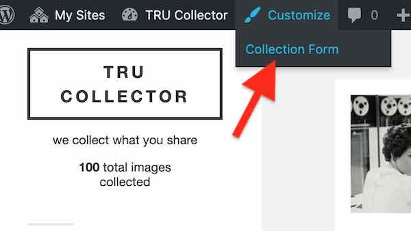
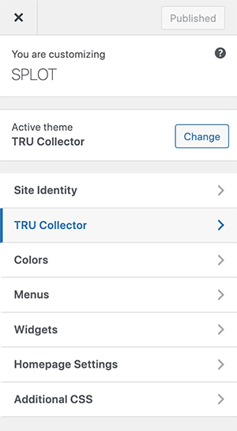

# TRU Collector Documentation

[:house: TRU Collector](README.md) 
[:mag: Examples in Action](examples.md)
[:rocket: Installing](install.md)
:book: Documentation **docs.md**

These is a reference for the settings and making use of other WordPress features in the [TRU Collector SPLOT theme](https://github.com/cogdog/tru-collector)

Speaking of WordPress...

*In this theme, `Posts` are renamed `Collectables` but have all the attributes of garden variety blog posts.* 


## TRU Collector Options

First log in to your WordPress Dashboard as an admin user. The options for controlling the site are available from either the WordPress Dashboard or anywhere from viewing the site  in your WordPress admin bar. 

Look for the menu item **TRU Collector Options** in the WordPress admin bar. This loads with the settings tab and items detailed below. You will also see a tab for **Documentation**, showing what you are reading now. This always displays the most up to date version of the documentation directly from the home source of this theme.

These settings provide you much control of the behavior of your TRU Collector site -- there are quite a few of them to review! Most of them have default settings which provide basic functionality for your site, but modifying them allows you much control of TRU Collector, especially the form where contributors add content to your site.

After making  updates to these settings, make sure you click the **Save Change**s button at the very bottom of the screen.


### Form Access Code


Leave this field blank if you want any visitor to be able to access the submission form on your site. You can always make it less accessible by not having any links as menus for the form but that's hardly super secure.. 

If you want to provide an access code (essentially a very weak password), just enter it here. All links to the form will require entry to see it.

Enter a decent **Access Hint** that will be displayed if someone does not enter the correct code.

### Special Pages

This theme has two pages that are created to use this SPLOT. Each is associated with a specific template that provide its functionality. Activating the TRU Collector theme *should* create these all for you when the theme is activated, but if not, create them as described below. 

You can edit the content of the pages to customize the introduction seen by contributors to your site.

If the theme does not do so automatically create these Wordpress **Pages**. You can modify the titles, and add whatever content you want to appear at the top as instructions, and as well change the short name or slug for the page.

* **Collect** -- The page that provides the collection form, see [http://splot.ca/collector/collect](http://splot.ca/collector/collect).  Whatever you include in the body (not required) is added to the top of the form, maybe for extra instructions of context for the form e.g. for a site at `http://coolest.site.org/` the page can be published at `http://coolest.site.org/collecting` When you create a Collection Form page, under **Page Atributes**, select the Template named `Add to Collection`.

* **Browse Items By License** -- If you use the settings below for contributors to select a reuse license, this page provides a way to see all items that share the same license-- like [http://splot.ca/collector/licensed/](http://splot.ca/collector/licensed/).  When you create a Browse By License page, under **Page Atributes**, select the Template named `Items by License`. 

In the TRU Collector options, make sure you have identified the Page that is designated for these these purposes.


### Publish Settings


The Status for a New Collectable lets you set up moderation for new submissions (by choosing `Set to draft`) whereas `Publish immediately` provides instant gratification to your visitors though leaves open the problems of a site where anyone can publish (the latter option thus works for sites where you set up an **Access Code** as described above).

Enter any email addresses who should be notified of new submissions; you can use multiple ones if you separate them by a comma.

### Sorting

The default settings are for typical blogs where newest content is displayed first. The sort options allow you to change that across the site- the home page and category/tag archives, as well as making that change only in certain areas.


**Date Published** is the default option, the order is **Descending**, or newest first, change to **Ascending** to have oldest items appear first. 

Change the sort otder to **Title** to... yes... sort items alphabetically by each item's title.  Use **Ascending** for alphabetical order (A-Z) or **Descending** to reverse (Z-A).

Use the **Sort Applies To** option to specify where the alternative sorting is applied (for example, just on tags archive, or just the home page).


### Item Descriptions


Set the description options to choose whether provide a field for visitors to enter a caption/description for their shared item, and whether to require that something be entered. 

By setting to **No** this will not appear on the submission form or will any descriptions be displayed, for maybe a site that just displays images.

Next is the option to enable a rich text editor in place of the default simple plain text  input. Use this if you want a site where people create formatted blog post like content to be published with the shared image

You can also populate the editor (other type) with default content, for example, if you wanted descriptions to have certain headings or a prompt.


### Item Display

Enabling  **Display Name of Person Sharing** provides an input field to the form for the person submitting the form (see the Customizer options to set  default), and enables the display of its value on a single view.

The **Source** field is a single line text entry where a visitor can type in the source of the image (if it includes a URL it will be automatically hyperlinked when the image page is displayed).

Enabling  **Show URL for media item** enables the display of a link for the uploaded media on a single view in the metadata listed below the content.


The **Rights License** sets up a drop down menu offering a variety of Creative Commons licenses as well as `All Rights Reserved` (boo!), and a `Usage Rights Unknown` choice for the person adding an item to your collection.

Enabling the **Cut and Paste Attribution** adds to the metadata displayed below the content a field with an automatically formed attribution statement (based on the image's rights license choice) that can be copied after clicking on the text.

Check **Enable Comments on Items**  to add a standard blog comment field at the bottom of all published items.

If you want users to choose categories, enable it on the form (setting to "no" will hide categories on the form and on the display of the item).

If you have not set up any categories, the **Default Category for New Collectables** menu just give you a choice of `Uncategorized`. If you want to modify this setting, first save your options,  edit your **Collectable Categories** (standard Wordpress Categories accessed under Collectables in the Dashboard), and return here to set up the desired default category. Please, don't leave `Uncategorized` on your site, it looks like you don't understand WordPress.

If you want users to enter tags, enable it on the form (setting to "no" will hide tags on the form and on the display of the item).

The last option here, **Show the input fields for notes** places on the input form a place for contributors to send info that only the site owner should see (never published).


### Email


Activating the email form field creates a means for visitors who wish to edit their entry later to get a special edit link sent via email. This feature can be disabled; enabled as optional, or as a required entry.

If you use this option, you can also enter a specific domain (or a comma separated list) to say require email addresses to be official work or school ones.

The third setting here can activate a checkbox on the entry form that let's a visitor choose to receive comment notifications via email.

## Customize the Form

In addition to editing the page content that appears above the form where people submit new items to your TRU Collector site, you can also change/edit all field labels and the descriptions on the form where people submit new items to your TRU Collector site. This provides a way to be very specific with the way you want your contributors to write a title, a description, their name, etc. 

Make sure you are logged in to your WordPress Dashboard. Then go to the public view of any part of your TRU Collector site. You should see the black admin bar at the top of your site. Under the **Customize**/**Customise** menu, select **Collection Form**. This switches the page in view of your SPLOT's submission form and opens the Customizer that allows you to modify the form.



Look for a special section TRU Collector tab to open, and two options. **Collection Info** provides a way to change some info used across the site,  but we want the second option for **Collection Form**. Here are the clicks to get here



Next you will see a series of fields to edit for all form field elements. For each one you can edit the title/label of the field and the prompt that appears below. As you type in the customizer fields on the left, you will see a live preview on the right (ignore the silly pizza references in the screenshot, the author was just hungry):


## Customize the Site

The section for the TRU Collector Customizer **Collection Info** allows you to make more specific the naming of items on your site to be more specific to your purpose. 

Find this part of the customizer:


You can edit  the name for things in your collection differently from the defualt `item` for example, as it is displayed on the sidebar below the site name


You can also change the header and add extra instructions/prompts if you want to modify how the comments area is displayed.


## Browse by Licenses

The TRU Collector provides archives of content that have the same reuse license (if the feature is activated via the TRU Collector options). Just make sure there is a Wordpress Page that uses the template  `Browse by license` -- and the Page is selected in the theme options (see above). This page is created automatically on new sites, or simply by activating the theme again (activate the parent Fukasawa, then activate TRU Collector again).


This page (see [example](http://splot.ca/collector/licensed/)) provides links to view all content with the licenses available on the collect form. The url including `licensed/cc-by` yields all items with a Creative Commons CC By Attribution license [example](http://splot.ca/collector/licensed/cc-by).

Use the page to find links to the ones you wish to use and add to your site's menus or widgets. 

If the links do not work, you may have to go to **Settings** -- **Permalinks** and just click save to regenerate the settings.


## Shortcodes 

The TRU Collector shortcodes provide a way to display other information about your collection in  WordPress page or a widget.


### Item Counts

Use [splotcount] to display the number of all published items


If you use the simpler plain tex field for adding descriptions, all HTML put into the plain is stripped out. This shortcode allows hyperlinks to be created using a "shortcode" format:


Links show be entered as a `[link]` shortcode where the link `url` is specified as well as the `text` to be used as hypertext:

`[link url="http://www.themostamazingwebsiteontheinternet.com/" text="the coolest site on the internet"]`

This will create a hyperlink like [the coolest site on the internet](http://www.themostamazingwebsiteontheinternet.com/)

To present the link just as a URL, simply use

`[link url="http://www.themostamazingwebsiteontheinternet.com/"]`

which will produce the hyperlink like http://www.themostamazingwebsiteontheinternet.com/ -- all links will open in a new window.

### Display All Tags

This was added as request for a site that had more than 45 tags, the maximum that can be displayed in the Tag Cloud widget, but might also be of use in any site where contributors are tagging content.

The basic use to list all tags is

`[taglist]`

which displays all tags used in alphabetical order, each linked to the associated archive, and the number of times the tag has been used.

Optional parameters include:

* `number=10` limit to ten tags (default=0 or all tags)
* `show_count=false` hides the display of the number of times tag used (default=true)
* `mincount=2` will only show tags used 2 or more times (default=1)
* `orderby="count"` to order results by the number of times tag used (default="name")
* `order="DESC"` to list in descending order (default="ASC")
* `hide_empty=0` to list tags not used (default=1)

In use, this will display the 20 most used tags

`[taglist number=20 orderby="count" order="DESC"]`

### Licensed content

For extra flexibility in addition to the page to show TRU Collector content by reuse license,  there is a `[licensed]` shortcode that can be used in a widget or any page to display the same index list in a sidebar. By default, it lists only licenses used (e.g. it skips licenses with zero uses); to show all licenses, use the code `[licensed show="all"]`.


## Optional / Suggested Plugins

As any WordPress site you can extend the functionality with any WordPress plugin you like. Below are ones that have been used or recommended for other TRU Collector powered sites,

### Public Ratings

Installing the [WP-Ratings Plugin](https://wordpress.org/plugins/wp-postratings/) enables public star (or other scale) ratings on items from the front page, archives, and single items. Visitors can rate content using a variety of ratings (1-5 stars, thumbs up/down, etc).


See it in action on the SPLOT demo site [front page](http://splot.ca/collector/) or [single item](http://splot.ca/collector/393/).

### OpenGraph Tags for Social Media Sharing

If you would like Twitter Cards and Facebook shares to use the main images and provide a more complete display, install, activate, and configure a plugin like [Open Graph and Twitter Card Tags](https://wordpress.org/plugins/wonderm00ns-simple-facebook-open-graph-tags/). This adds the special [open graph tags](https://ogp.me/) to your site's pages to enable better social media share previews.

### Tiled Displays 

Install the [WP-Tiles plugin](https://wordpress.org/plugins/wp-tiles/) to create alternative views of your collections as a tiled gallery. The plugin provides  way to create a variety of grid styles, and can be added to a Page in your site using a shortcode. This can even be set to be the FRONT page of your site using **Settings** -> **Reading** in your WordPress dashboard as was down for the [#OWLTEH18 Conference Photos site](https://www.conf.owlteh.org/photos/):


Or see examples as internal pages from the [SPLOT demo site](http://splot.ca/collector/mural/) or the [Mural UDG project Accumulador site](https://muraludg.org/acumulador/mural/).

Learn more about using this plugin https://cogdogblog.com/2018/01/tiling-splots/

### Fix Rotated Mobile Phone Photos

If contributors to your collection will be uploading photos directly from a smart phone, install the [iOS Image Fixer plugin](https://wordpress.org/plugins/ios-images-fixer/) to fix [problems associated with portrait mode photos that end up uploaded as sideways images](https://wordpress.org/plugins/ios-images-fixer/).

### Other Wordpressy Things You Might Want to Do

Like most WordPress themes, the default view of your site is the most recent items added. But you may want to have a custom landing page that explains the purpose of the site, see for example https://quilt.femedtech.net/ or https://somni.arganee.world/

First, create a new, custom WordPress page that has all the elements and information you want to appear as an introduction on the home page of the site. 

If you want to have another page that lists the newest item like WordPress usually does, create a second page that only needs a title like "Newest Stuff" or "Recent Submissions". You do not have to write any content. 

Now, in your Dashboard, under  **Settings** -- **Reading** change the top option for Your `homepage displays` from the default `Your latest posts` to `a static page (select below)` Now select the new page you created for `Homepage` and the second one for `Posts`.

This is one of the simplest ways to provide an introduction to your site.

Also, personally, I like short URLs, and long titles make for long links! I typically use a Custom Permalink setting (under **Settings** -- **Permalinks**) of just `/%post_id%/`

 

The TRU Collector theme has a special URL feature --  `/random` added to your home URL  provides a redirection to a random item in your TRU Collector, e.g. http://splot.ca/collector/random

You can use this as a menu item or a link anywhere in your site.

Set up your own menus as needed; make sure that you click the `Location` tab to tell Wordpress to use the menu you create.

 

Get rid of the default widgets on the site, make it your own!

 

The images as shown in a single item view are meant by the theme to fill the space. One user of the theme setting a Collector up for conference participants to post bios, asked if they could be smaller as it put off a few of their testers.

This is a job for adding some custom CSS to your own site (navigate to a single item and use the Customize link in the black admin bar). Then under "Additional CSS" try this bit of styling, it sizes them to half the width of the page and adds a bit of space (margin) at the top.

````
.single .featured-media img {
    width: 50%;
    margin: 5% auto 0;
}
````

You will see results instantly, and you might try different values of the width and/or adjust the first percentage for margin (that puts space at the top).

Once it seems sized appropriately, click "Publish"

## Got Questions

This is quite a lot to take in, but these options and settings have been designed to allow you to change the way your site works that other wise would require custom programming. They also reflect the feedback of other users of TRU Collector.

Please make use of the [Discussion space on GitHub](https://github.com/cogdog/tru-collector/discussions/)! I love hearing from you.
