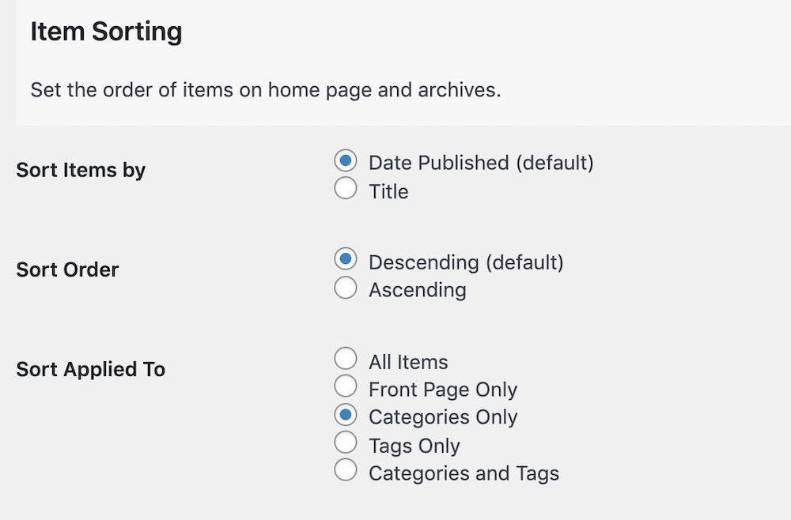
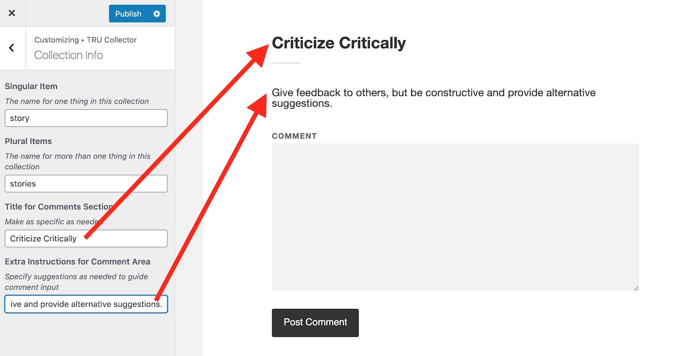

# TRU Collector Documentation
by Alan Levine http://cogdog.info/ or http://cogdogblog.com/

These instructions are a reference for the settings and other WordPress features within the [TRU Collector SPLOT theme](https://github.com/cogdog/tru-collector) (look there for more details about the theme, examples, etc).


## Starting Notes
*In this theme Wordpress `Posts` are renamed `Collectables` but have all the attributes of garden variety blog posts.*


You might want to set up in advance some Wordpress Categories for your Collectables; in the options you will choose one as default (and for the love of all that is holy, *change the name of the Uncategorized category*!)

## Using TRU Collector options

Look for the link to TRU Collector Options in your WordPress admin bar, and from there you will find a tab for documentation, what you are reading now. This always displays the most up to date version of the documentation.

These options provide you much control of the behavior of your TRU Collector site -- there are quite a few settings!


### Access to Collector


Leave this field blank if you want any visitor to be able to access the submission form on your site (you can always make it less accessible by not having any links as menus for the form. 

If you want to provide an access code (a very weak password), just enter it. Any requests to access to form will be sent to the **Welcome Desk** page where a visitor must enter in the code you have entered here to see the form.

Enter a decent **Access Hint** that will be displayed if someone does not enter the correct code.

### Special Pages Setup

This theme has three pages that must be created; each is associated with a specific template that provide it's functionality. Activating the theme *should* create these all for you when the theme is activated, but if not, create them as described below. You can edit the content of the pages to customize the prompt seen by contributors to your site.

If the theme does not do so automatically (and it should) create these Wordpress **Pages**. You can modify the titles, and add whatever content you want to appear at the top as instructions. Unlike previous versions, there is no need for a specific url for the page. 

* **Collect** -- The page that provides the collection form, see [http://splot.ca/collector/collect](http://splot.ca/collector/collect).  Whatever you include in the body (not required) is added to the top of the form, maybe for extra instructions.e.g. for a site at `http://coolest.site.org/` the page can be published at `http://coolest.site.org/collecting` When you create a Collection Form page, under **Page Atributes**, select the Template named `Add to Collection`.

* **Browse Items By License** -- If you ask visitors to select a reuse license, this page provides a way to see all items that share the same license-- like [http://splot.ca/collector/licensed/](http://splot.ca/collector/licensed/).  When you create a Browse By License page, under **Page Atributes**, select the Template named `Items by License`.

In the theme options, make sure you have identified the Page that is designated for these purposes.


### Publish Settings


The Status for New Collectable lets you set up moderation for new submissions (by choosing `Set to draft`) whereas `Publish immediately` provides instant gratification to your visitors though leaves open the problems of a site where anyone can publish (the latter option thus works for sites where you set up an **Access Code** as described above).

Enter any email addresses who should be notified of new submissions; you can use multiple ones if you separate them by a comma.

### Sort Options

The default settings are for typical blogs where newest content is displayed first. The sort options allow you to change that across the site- the home page and category/tag archives, as well as making that change only in certain areas.



**Date Published** is the default option, the order is **Descending**, or newest first, change to **Ascending** to have oldest items appear first. 

Change the sort otder to **Title** to... yes... sort items alphabetically by each item's title.  Use **Ascending** for alphabetical order (A-Z) or **Descending** to reverse (Z-A).

Use the **Sort Applies To** option to specify where the alternative sorting is applied (for example, just on tags archive, or just the home page).


### Fields and Options for Items


Set the description options to choose whether provide a field for visitors to enter a caption/description for their shared item, and whether to require that something be entered. By setting to **No** this will not appear on the submission form or will any descriptions be displayed..

Next is the option to enable a rich text editor in place of the default simple text area input. Use this if you want a site where people create formatted blog=post like content or plain text captions.

You can also populate the editor (other type) with default content, for example, if you wanted  descriptions to have certain headings.


Enabling  **Display Name of Person Sharing** provides the input field to the form, and enables the display of its value on a single view.

The **Source** field is a single line text entry where a visitor can type in the source of the image (if it includes a URL it will be automatically hyperlinked when the image page is displayed).

Enabling  **Show URL for media item** enables the display of a link for the uploaded media on a single view.


The **Rights License** is a drop down menu offering a variety of Creative Commons licenses as well as `All Rights Reserved` (boo!), and a `Usage Rights Unknown` choice.

Enabling the **Cut and Paste Attribution** adds to the image display a field with an automatically formed attribution statement (based on the image's rights license choice) that can be copied after clicking on the text.

Check **Enable Comments on Items**  to add a standard blog comment field at the bottom of all published items.

If you want users to choose categories, enable it on the form (setting to "no" will hide categories on the view page).

If you have not set up any categories, the **Default Category for New Collectables** menu just give you a choice of `Uncategorized`. If you want to modify this setting, first save your options,  edit your **Collectable Categories** (standard Wordpress Categories accessed under Collectables in the Dashboard), and return here to set up the desired default category. Please, don't leave `Uncategorized` on your site!

If you want users to enter tags, enable it on the form (setting to "no" will hide tags on the view page).

The last option here creates field on the input form for users to send information that is not displayed.


### Email Options


Activating the email form field creates a means for visitors who wish to edit their entry later to get a special edit link sent via email. This feature can be disabled; enabled as optional, or as a required entry.

If you use this option, you can also enter a specific domain (or a comma separated list) to say require email addresses to be official work or school ones.

The third setting here can activate a checkbox on the entry form that let's a visitor choose to receive comment notifications via email.

## Customize the Add / Collect form

You can now customize the field labels and the descriptions of the form where people submit new items to a TRU Collector site. On your site navigate to the collect form, and  activate the Wordpress Customizer from the admin bar. 

There is a special section TRU Collector tab to open:


Then from this pane, open "Collect Form" 


And then you will see a series of fields to edit for all form field elements. For each, you can edit the title/label of the field and the prompt that appears below. As you type in the customizer fields on the left, you will see a live preview on the right (ignore the silly pizza references in the screenshot, the author was just hungry):


A new feature is a menu item under **Customize** that allows you to open the customizer with the current collection form displayed.


## Customize Your TRU Collector Site

A new section for the TRU Collector Customizer **Collection Info** allows you to specify the name for the kinds of things in your collection as it is displayed on the sidebar below the site name.


You can also change the header and add extra instructions/prompts if you want to modify how the comments area is displayed.



### Not So Big Featured Images 

The images as shown in a single item view are meant by the theme to fill the space. One user of the theme setting a Collector up for conference participants to post bios, asked if they could be smaller as it put off a few of their testers.

This is a job for adding some custom CSS to your own site (navigate to a single item and use the Customize link in the black admin bar). Then under "Additional CSS" try this bit of styling, it sizes them to half the width of the page and adds a bit of space (margin) at the top.

````
.single .featured-media img {
    width: 50%;
    margin: 5% auto 0;
}
````

You will see results instantly, and you might try different values of the width and/or adjust the first percentage for margin (that puts space at the top).

Once it seems sized appropriately, click "Publish"


## Browse by Licenses

The TRU Collector provides archives of content that have the same reuse license (if the feature is activated via the TRU Collector options). Just make sure there is a Wordpress Page that uses the template  `Browse by license` -- and the Page is selected in the theme options (see above). This page is created automatically on new sites, or simply by activating the theme again (activate the parent Fukasawa, then activate TRU Collector again).


This page (see [example](http://splot.ca/collector/licensed/)) provides links to view all content with the licenses available on the collect form. The url including `licensed/cc-by` yields all items with a Creative Commons CC By Attribution license [example](http://splot.ca/collector/licensed/cc-by).

Use the page to find links to the ones you wish to use and add to your site's menus or widgets. If the links do not work, you may have to go to **Settings** -- **Permalinks** and just click save to regenerate the settings.


For extra flexibility there is a `[licensed]` shortcode that can be used in a widget or any page to display the same index list in a sidebar. By default, it lists only licenses used (e.g. it skips licenses with zero uses); to show all licenses, use the code `[licensed show="all"]`.

## Shortcodes 

### Count of Published items

Use [splotcount] to display the number of all published items


###  Adding Hyperlinks to Simple Descriptions

Any HTML put into the plain text editor for  captions is stripped out. A feature allows hyperlinks to be created using a "shortcode" format:


Links show be entered as a `[link]` shortcode where the link `url` is specified as well as the `text` to be used as hypertext:

`[link url="http://www.themostamazingwebsiteontheinternet.com/" text="the coolest site on the internet"]`

This will create a hyperlink like [the coolest site on the internet](http://www.themostamazingwebsiteontheinternet.com/)

To present the link just as a URL, simply use

`[link url="http://www.themostamazingwebsiteontheinternet.com/"]`

which will produce the hyperlink like http://www.themostamazingwebsiteontheinternet.com/ -- all links will open in a new window.

### Display All Tags

By request for a site that had more than 45 tags (that is the maximum that can be displayed in the Tag Cloud widget.

The basic use is just

`[taglist]`

which displays all tags used in alphabetical order, each linked to an archive, and the number of times used listed.

Optional parameters include:

* `number=10` limit to ten tags (default=0 or all tags)
* `show_count=false` hides the display of the number of times tag used (default=true)
* `mincount=2` will only show tags used 2 or more times (default=1)
* `orderby="count"` to order results by the number of times tag used (default="name")
* `order="DESC"` to list in descending order (default="ASC")
* `hide_empty=0` to list tags not used (default=1)

In use, this will display the 20 most used tags

`[taglist number=20 orderby="count" order="DESC"]`


## Optional / Suggested Plugins

### Add Public Ratings

Installing the [WP-Ratings Plugin](https://wordpress.org/plugins/wp-postratings/) enables public star (or other scale) ratings on items from the front page, archives, and single items. Visitors can rate content using a variety of ratings (1-5 stars, thumbs up/down, etc).


See it in action on the SPLOT demo site [front page](http://splot.ca/collector/) or [single item](http://splot.ca/collector/393/).

### OpenGraph Tags for Social Media Sharing

If you would like Twitter Cards and Facebook shares to use the main images and provide a more complete display, install, activate, and configure a plugin like [Open Graph and Twitter Card Tags](https://wordpress.org/plugins/wonderm00ns-simple-facebook-open-graph-tags/). This adds the special [open graph tags](https://ogp.me/) to your site's pages to enable better social media share previews.

### Tiled Displays 

Install the [WP-Tiles plugin](https://wordpress.org/plugins/wp-tiles/) to create alternative views of your collections as a tiled gallery. The plugin provides  way to create a variety of grid styles, and can be added to a Page in your site using a shortcode. This can even be set to be the FRONT page of your site using **Settings** -> **Reading** in your WordPress dashboard as was down for the [#OWLTEH18 Conference Photos site](https://www.conf.owlteh.org/photos/):


Or see examples as internal pages from the [SPLOT demo site](http://splot.ca/collector/mural/) or the [Mural UDG project Accumulador site](https://muraludg.org/acumulador/mural/).

Learn more about using this plugin https://cogdogblog.com/2018/01/tiling-splots/

### Fix Rotated Mobile Phone Photos

If contributors to your collection will be uploading photos directly from a smart phone, install the [iOS Image Fixer plugin](https://wordpress.org/plugins/ios-images-fixer/) to fix [problems associated with portrait mode photos that end up uploaded as sideways images](https://wordpress.org/plugins/ios-images-fixer/).

### Other Wordpressy Things You Might Want to Do

I like short links, so I typically use a Custom Permalink setting (under `Settings -- Permalinks`) of `/%post_id%/'

 

The theme creates a special URL `/random` to provide a link that shows a random item, e.g. http://splot.ca/collector/random

Set up your own menus as needed; make sure that you click the `Location` tab to tell Wordpress to use the menu you create.

 

Get rid of the default widgets on the site, make it your own!

 
