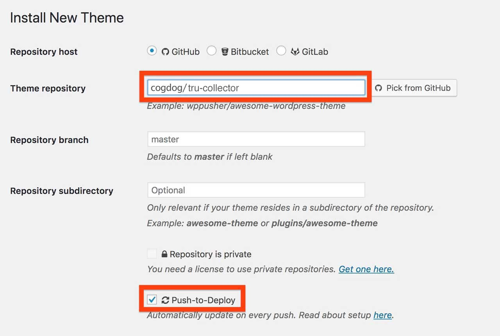

# How to Install the TRU Collector Theme

Using this theme requires a self-hosted-- or institutionally hosted (lucky you)-- Wordpress site (the kind that you download from [wordpress.org](http://www.wordpress.org). You cannot use this theme on the free "wordpress.com" site unless you have a business plan. Maybe check out [Reclaim Hosting](https://reclaimhosting.com/)  to set up your own hosting space. They are awesome.

The TRU Collector is a child theme based on [the free and elegant Fukasawa theme by Anders Noren](https://wordpress.org/themes/fukasawa). Install this theme first from within the Wordpress Dashboard under **Appearance** -- **Themes** searching on `Fukasawa`.

## Installing TRU Collector from Scratch

(1) Create a fresh new Wordpress site. 

(2) Install the [Fukasawa theme](https://wordpress.org/themes/fukasawa) from the Wordpress Dashboard (I'll gamble that you know how to install themes, search on `Fukasawa` from Appearances -- Themes. It does not need to be activated, it just needs to be present.

(3) Install the TRU Collector theme,

You can download a ZIP file of this theme via the green **Code*" button above (use the Download Zip option). 

The zip can be uploaded directly to your site via **Themes** in the Wordpress dashboard, then **Add Theme** and finally **Upload Theme**. If you run into size upload limits or just prefer going old school like me, unzip the package and ftp the entire folder into your `wp-content/themes` directory.

(4) Activate TRU Collector as the site's theme. 

As of WordPress version 5.5, themes uploaded as .ZIP files can now be updated the same way you installed it. Just download the newest version, and update it by going to **Themes** in the Wordpress dashboard, then **Add Theme** and finally **Upload Theme**. You will be asked to confirm updating the theme with the newer version.  

## Installing TRU Collector in One Click with WP Pusher (get automatic updates!)

To have your site stay up to date automatically, I recommend trying the [WP Pusher plugin](https://wppusher.com/) which makes it easier to install themes and plugins that are published in GitHub. It takes a few steps to set up, but it's the most direct way to get updates to the theme.

To use WP-Pusher you will need to have or create an account on [GitHub](https://github.com/) (free). Log in. 

Next [download WP Pusher plugin](https://wppusher.com/download) as a ZIP file. From the plugins area of your Wordpress dashboard, click the **Upload Plugin** button, select that zip file to upload, and activate the plugin.

Then click the **WP Pusher** option in your Wordpress Dashboard, and then click the **GitHub** tab. Next click the **Obtain a GitHub Token** button to get an authentication token. Copy the one that is generated, paste into the field for it, and finally, click **Save GitHub** Token.

Now you are ready to install TRU Collector! 

Look under **WP Pusher** for **Install Theme**. In the form that appears, under **Theme Repository**, enter `cogdog/tru-collector`. Also check the option for **Push-to-Deploy** (this will automatically update your site when the theme is updated) finally, click **Install Theme**.

Woah Neo?

Not only does this install the theme without any messy download/uploads, each time I update the theme on GitHub, your site will be automatically updated to the newest version.  

## Installing From Reclaim Hosting

If you are wise enough to host your web sites at [Reclaim Hosting](http://reclaimhosting.com/) you have the option of installing a fully functioning site with this theme ([a copy of the demo site](http://lab.cogdogblog.com/collector/)) including recommended plugins, configured settings and sample content, all done  in one click. *But wait there is more!* With this method of installing your site, future updates to the theme are automatically added to your site (though not as frequently as the WP Pusher method).

In your cpanel, under **Applications** go to **All Applications**. This theme is available listed under Fratured Applications; just install from there.

*Note that unlike other WordPress installs, this one will not preserve your username/password, so be sure to save that information.* When it's done, log into your new site and start making it your own following the steps below.

## Inserting Demo Content

If you want a site that is not completely empty, after setting up with WP-Pusher or from scratch, you can import all the content set up on the [public demo site](https://lab.cogdogblog.com/collector). 

Install all content by [downloading the WordPress export for that site](https://github.com/cogdog/tru-collector/blob/master/data/tru-collector.xml).  Running the WordPress Importer (under **Tools** -- **Import**) and upload that file when prompted.

You can also get a copy of the Widgets used on that site too. First install/activate the [Widget Importer & Exporter plugin](https://wordpress.org/plugins/widget-importer-exporter/). Download the [Collector Widgets data file](https://github.com/cogdog/tru-collector/blob/master/data/tru-collector-widgets.wie). Look under the **Tools** menu for **[Widget Importer & Exporter** and use the Import Widgets section to upload the data file. Boom! You got my widgets.